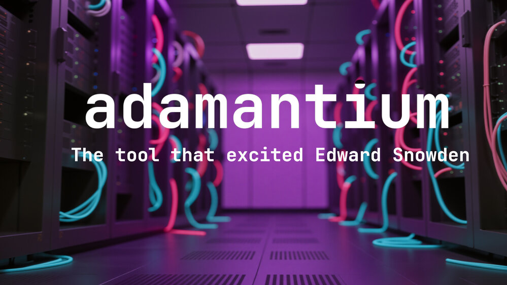

# adamantium

[English](README.md) | [Español](README.es.md)

<p align="center">
  
</p>

<p align="center"><strong>Deep metadata cleaning | The tool that excited Edward Snowden</strong></p>

A powerful command-line tool with TUI (Text User Interface) designed to completely and securely remove metadata from various types of files.

[](https://opensource.org/licenses/MIT)
[](https://www.linux.org/)
[](https://github.com/yourusername/adamantium/releases)

---

## 🎯 Features

- **Deep Cleaning**: Combines ExifTool and ffmpeg for maximum effectiveness
- **Complete Visualization**: Shows **ALL** metadata BEFORE and AFTER cleaning (no filtering)
- **Modern TUI**: Colors, **emojis** and attractive terminal design 🛡️✨
- **Sensitive Metadata Detection**: Marks critical fields in RED (GPS, Parameters, Author, Camera, etc.)
- **International Support**: Automatic language detection (English/Spanish)
- **Universal Linux**: Works on any distribution (Arch, Ubuntu, Fedora, Debian, openSUSE, Alpine)
- **Multiple Supported Formats**:
  - 📹 **Multimedia**: MP4, MOV, AVI, MKV, MP3, FLAC, WAV, etc.
  - 🖼️ **Images**: JPG, PNG, TIFF, GIF, WebP, etc.
  - 🖼️ **AI Images**: PNG with Stable Diffusion, Flux, DALL-E metadata, etc.
  - 📄 **PDFs**: PDF documents
  - 📝 **Office Documents**: DOCX, XLSX, PPTX, ODT, ODS, etc.
- **Preserves Original File**: Always keeps your original file intact
- **Automatic Detection**: Identifies file type and applies optimal method
- **Metadata Counter**: Shows how many fields were found and removed

---

## 🔒 Why Removing Metadata is Crucial for Your Privacy

Metadata is **invisible information** inside your files that can reveal much more than you imagine:

- **📍 Exact location**: Photos store GPS coordinates of where they were taken (your home, work, places you visit)
- **👤 Identity**: Documents reveal your name, company, email, software you use
- **🕐 Timeline**: Precise dates and times of file creation and modification
- **🤖 Technical secrets**: AI-generated images reveal the exact prompts you used, models, seeds and complete configuration
- **📷 Equipment**: Camera brand and model, serial number, photo settings

**Once you share a file, this metadata can end up anywhere**: from simple curious people to companies that sell your information or malicious actors who can use this data to track you, identify you or compromise your security.

adamantium allows you to **clean all this metadata in seconds**, showing you exactly what hidden information existed and verifying it was completely removed. It's fast, effective and gives you total control over what information you actually share.

**Privacy is not paranoia, it's intelligent precaution.**

---

## 📋 Requirements

### Required Dependencies

- **exiftool**: For standard metadata cleaning (minimum v13.39)
- **ffmpeg**: For deep multimedia container cleaning (minimum v8.0)

### Installation by Distribution

```bash
# Arch Linux / Manjaro / EndeavourOS
sudo pacman -S perl-image-exiftool ffmpeg

# Ubuntu / Debian / Linux Mint / Pop!_OS
sudo apt-get update
sudo apt-get install libimage-exiftool-perl ffmpeg

# Fedora / RHEL / CentOS / Rocky Linux
sudo dnf install perl-Image-ExifTool ffmpeg

# openSUSE Leap / Tumbleweed
sudo zypper install exiftool ffmpeg

# Alpine Linux
sudo apk add exiftool ffmpeg
```
---

## 🚀 Installation

### Automatic Installation (Recommended)

```bash
# Clone the repository
git clone https://github.com/yourusername/adamantium.git
cd adamantium

# Run the installer
chmod +x install.sh
./install.sh
```

The installer will:
- Automatically detect your Linux distribution
- Install necessary dependencies
- Create a symbolic link in `/usr/local/bin/`
- Verify everything works correctly

### Manual Installation

```bash
# Clone the repository
git clone https://github.com/yourusername/adamantium.git
cd adamantium

# Make the script executable
chmod +x adamantium

# Create global symbolic link (optional)
sudo ln -s "$(pwd)/adamantium" /usr/local/bin/adamantium
```

### Use Without Installation

```bash
cd adamantium
./adamantium <file>
```

For detailed installation instructions, see [INSTALLATION.md](INSTALLATION.md).

---

## 📖 Usage

### Basic Syntax

```bash
adamantium <file>                    # Generates file_clean.ext
adamantium <file> <output_file>      # Specifies output name
```

### Examples

```bash
# Clean a PDF
adamantium document.pdf
# Generates: document_clean.pdf

# Clean a video with custom name
adamantium video.mp4 safe_video.mp4

# Clean an image
adamantium photo.jpg
# Generates: photo_clean.jpg

# Clean an Office document
adamantium presentation.pptx
# Generates: presentation_clean.pptx

# Clean an audio file
adamantium song.mp3 song_no_metadata.mp3
```

---

## 🌍 Language Support

adamantium automatically detects your system language:

- **English** (default) - For all users
- **Spanish** - If your system is configured with `LANG=es_*`

No configuration needed! The detection is automatic.

---

## 🎨 TUI Interface

adamantium provides a clear and attractive visual interface with **modern emojis**:

### Visual Elements

- ✅ **Green check**: Successful operation
- ❌ **Red cross**: Error
- → **Cyan arrow**: Action indicator
- ● **Colored dots**: Metadata categorization
- ⚠️ **Warning**: Important information
- 🧹 **Cleaning**: Metadata cleaning process
- 🛡️ **Shield**: Privacy and security
- 📁 **File**: File identifier
- 📊 **Size**: Size information
- 🎬 **Video**: Multimedia files
- 🖼️ **Image**: Image files
- 📄 **PDF**: PDF documents
- 📝 **Office**: Office documents
- 🔍 **Search**: Metadata analysis
- ✨ **Sparkles**: Successfully completed
- 🔧 **Tool**: Processing method

### Metadata Color Codes

- 🔴 **Red**: Sensitive metadata (Author, GPS, Location, Artist, Company)
- 🟡 **Yellow**: Technical metadata (Dates, Software, Encoder)
- 🔵 **Blue**: General metadata (Name, Size, Type)

---

## 🔍 How It Works

### Cleaning Process

1. **Detection**: Automatically identifies file type (MIME type)
2. **Initial Analysis**: Shows all metadata present in the file
3. **Cleaning**:
   - **Multimedia files** (video/audio):
     1. ffmpeg removes container metadata
     2. ExifTool removes residual metadata
   - **Other files** (images, PDFs, documents):
     1. ExifTool removes all metadata
4. **Verification**: Shows metadata from clean file
5. **Summary**: Information about processed file

### Cleaning Methods

| File Type                    | Tools Used        | Description                                   |
|------------------------------|-------------------|-----------------------------------------------|
| Video (MP4, MKV, AVI, etc.)  | ffmpeg + ExifTool | Container and embedded metadata cleaning      |
| Audio (MP3, FLAC, WAV, etc.) | ffmpeg + ExifTool | ID3 tags and stream metadata removal          |
| Images (JPG, PNG, etc.)      | ExifTool          | EXIF, IPTC, XMP removal                       |
| PDFs                         | ExifTool          | Metadata, author, creator removal, etc.       |
| Office Documents             | ExifTool          | Document properties removal                   |

---

## 🐛 Troubleshooting

### exiftool not found

Install exiftool according to your distribution (see [Requirements](#-requirements) section above).

### ffmpeg not found

Install ffmpeg according to your distribution (see [Requirements](#-requirements) section above).

### Clean file won't play/open

- For multimedia: Verify the original file is in good condition
- Some corrupted files may cause problems
- Try with VLC or mpv which are more tolerant

### Not all metadata removed

Some metadata may be integrated in the data stream. For extreme cases:

- **Multimedia**: Consider re-encoding the file (involves quality loss)
- **Documents**: Use specialized tools like Dangerzone for complete conversion

For more help, see [INSTALLATION.md](INSTALLATION.md) troubleshooting section.

---

## ⚙️ Batch Processing

To clean multiple files, you can use the included script:

```bash
# Clean all JPG in a directory
./batch_clean.sh ./photos jpg

# Clean all PDFs recursively
./batch_clean.sh ~/Documents pdf --recursive

# Clean all MP4 in a directory
./batch_clean.sh /media/videos mp4
```

See [EXAMPLES.md](EXAMPLES.md) for more practical examples.

---

## 📊 Comparison with Other Tools

| Tool        | Multimedia | PDFs | Office | Images | Active Development |
|-------------|------------|------|--------|--------|--------------------|
| adamantium  | YES        | YES  | YES    | YES    | YES                |
| mat2        | PARTIAL    | YES  | YES    | YES    | NO (stalled)       |
| ExifTool    | PARTIAL    | YES  | YES    | YES    | YES                |
| ffmpeg only | YES        | NO   | NO     | NO     | YES                |

---

## 🔮 Roadmap

### v1.5 (Interactivity and Verification)

- [ ] Interactive mode with file selection
- [ ] `--verify` option for before/after hash comparison
- [ ] Support for compressed files (ZIP, TAR, RAR, 7Z)
- [ ] `--dry-run` mode to preview without applying
- [ ] Improved batch mode with progress bar
- [ ] Duplicate detection by hash

### v2.0 (Integration and Automation)

- [ ] File manager integration (Nautilus, Dolphin) via context menu
- [ ] JSON/CSV report generation
- [ ] Custom configuration via `~/.adamantiumrc` file
- [ ] Recursive mode integrated in main script
- [ ] Optional detailed logs in `~/.adamantium.log`
- [ ] Desktop notifications on completion

### v3.0 (Advanced and Professional)

- [ ] Optional re-encoding for multimedia (with quality control)
- [ ] Dangerous metadata detection with alerts and risk levels
- [ ] Forensic tools integration (report compatibility)
- [ ] REST API for remote use
- [ ] Plugin system for extensibility
- [ ] Optional GUI (GTK4/Qt6)

---

## 🤝 Contributing

Contributions are welcome! Please see [CONTRIBUTING.md](CONTRIBUTING.md) for:

- Code of conduct
- How to report bugs
- How to suggest features
- Code standards
- Pull request process
- Testing requirements

---

## 📜 License

This project is licensed under the MIT License - see the [LICENSE](LICENSE) file for details.

---

## ⚠️ Limitations and Warnings

### Technical Limitations

- **Not infallible**: Some metadata may be deeply integrated in the file
- **Multimedia**: The only 100% secure way is re-encoding (involves quality loss)
- **Complex Office files**: Macros and embedded objects may contain hidden metadata

### Recommended Uses

- ✅ Share photos on social media without GPS location
- ✅ Send professional documents without corporate metadata
- ✅ Publish videos without editing software information
- ✅ Distribute files without revealing creation dates
- ✅ Anonymize files before uploading them publicly

### NOT Recommended For

- ❌ Files with DRM or copy protection
- ❌ Professional forensics evasion (use specialized tools)
- ❌ System or executable files

---

## 📚 Additional Resources

### Documentation

- [QUICKSTART.md](QUICKSTART.md) - Quick start guide
- [INSTALLATION.md](INSTALLATION.md) - Detailed installation
- [EXAMPLES.md](EXAMPLES.md) - Practical examples
- [STRUCTURE.md](STRUCTURE.md) - Code architecture
- [CONTRIBUTING.md](CONTRIBUTING.md) - Contribution guide
- [CHANGELOG.md](CHANGELOG.md) - Version history

### Tool Documentation

- [ExifTool Documentation](https://exiftool.org/)
- [ffmpeg Documentation](https://ffmpeg.org/documentation.html)

### Privacy and Security

- [Metadata Anonymization Toolkit (MAT2)](https://0xacab.org/jvoisin/mat2)
- [Dangerzone - Safe document conversion](https://github.com/freedomofpress/dangerzone)

---

## 🙏 Acknowledgments

- **ExifTool** by Phil Harvey
- **ffmpeg** by FFmpeg team
- All contributors and the open source community

---

**adamantium** - Protect your privacy by effectively removing metadata.

*Deep metadata cleaning | The tool that excited Edward Snowden*
